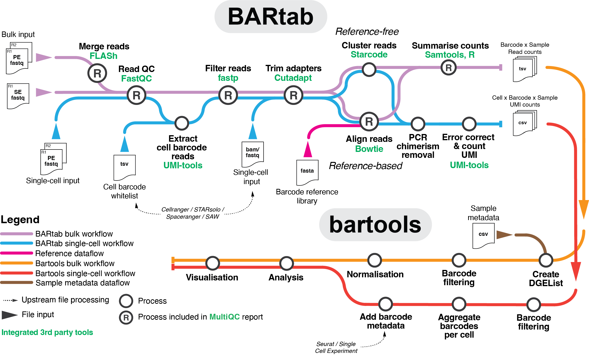

# BARtab
A Nextflow pipeline to tabulate synthetic barcode counts from NGS data

[](https://zenodo.org/doi/10.5281/zenodo.10896646)

- [Parameters](#parameters)
- [Pipeline summary](#pipeline-summary)
  - [Bulk workflow](#bulk-workflow)
  - [Single-cell workflow](#single-cell-workflow)
  - [Spatial data](#spatial-data)
- [Dependiencies](#dependiencies)
- [Installing the pipeline](#installing-the-pipeline)
- [Running the pipeline](#running-the-pipeline)
- [Performance](#performance)
- [Module Descriptions](#module-descriptions)




BARtab integrates with the R package [bartools](https://github.com/DaneVass/bartools) for downstream QC, analysis and visualization of population-level and single-cell level cellular barcoding datasets.  
Please see our [preprint](https://www.biorxiv.org/content/10.1101/2023.11.21.568179v1.full) for application examples. 

Please check [NEWS.md](NEWS.md) for changes in BARtab v1.4.

## Parameters

```
  Usage: nextflow run DaneVass/bartab --indir <input dir>
                                      --outdir <output dir>
                                      --ref <path/to/reference/fasta>
                                      --mode <single-bulk | paired-bulk | single-cell>

    Input/output arguments:
      --indir                    Directory containing input *.fastq.gz files. 
                                    Must contain R1 and R2 if running in mode paired-bulk or single-cell.
                                    For single-cell mode, directory can contain BAM files.
      --input_type               Input file type, either fastq or bam, only relevant for single-cell mode [default = fastq]
      --ref                      Path to a reference fasta file for the barcode / sgRNA library.
                                    If null, reference-free workflow will be used for single-bulk and paired-bulk modes.
      --mode                     Workflow to run. <single-bulk, paired-bulk, single-cell>
      --outdir                   Output directory to place output [default = './']

    Read merging arguments:
      --mergeoverlap             Length of overlap required to merge paired-end reads [default = 10]

    Filtering arguments:
      --minqual                  Minimum PHRED quality per base [default = 20]
      --pctqual                  Percentage of bases within a read that must meet --minqual [default = 80]
      --complexity_threshold     Complexity filter [default = 0]
                                    Minimum percentage of bases that are different from their next base (base[i] != base[i+1])

    Trimming arguments:
      --constants                Which constant regions flanking barcode to search for in reads: up, down or both. 
                                 "all" runs all 3 modes and combines the results. <up, down, both, all> [default = 'up']
      --upconstant               Sequence of upstream constant region [default = 'CGATTGACTA'] // SPLINTR 1st gen upstream constant region
      --downconstant             Sequence of downstream constant region [default = 'TGCTAATGCG'] // SPLINTR 1st gen downstream constant region
      --up_coverage              Number of bases of the upstream constant that must be covered by the sequence [default = 3]
      --down_coverage            Number of bases of the downstream constant that must be covered by the sequence [default = 3]
      --constantmismatches       Proportion of mismatched bases allowed in constant regions [default = 0.1]
      --min_readlength           Minimum length of barcode sequence [default = 20]
      --barcode_length           Optional. Length of barcode if it is the same for all barcodes. 
                                    If constant regions are trimmed on both ends, reads are filtered for this length. 
                                    If either constant region is trimmed, this is the maximum sequence length. 
                                    If barcode_length is set, alignments to the middle of a barcode sequence are filtered out.

    Mapping arguments:
      --alnmismatches            Number of allowed mismatches during reference mapping [default = 2]
      --barcode_length           (see trimming arguments)
      --cluster_unmapped         Cluster unmapped reads with starcode [default = false]

    Reference-free arguments:
      --cluster_distance         Defines the Levenshtein distance for clustering lineage barcodes [default = 3].
      --cluster_ratio            Cluster ratio for message passing clustering. 
                                    A cluster of barcode sequences can absorb a smaller one only if it is at least x times bigger [default = 3].

    Sincle-cell arguments:
      --cb_umi_pattern           Cell barcode and UMI pattern on read 1, required for fastq input. 
                                    N = UMI position, C = cell barcode position [default = CCCCCCCCCCCCCCCCNNNNNNNNNNNN]
      --cellnumber               Number of cells expected in sample, only required when fastq provided. whitelist_indir and cellnumber are mutually exclusive
      --whitelist_indir          Directory that contains a cell ID whitelist for each sample <sample_id>_whitelist.tsv
      --umi_dist                 Hamming distance between UMIs to be collapsed during counting [default = 1]
      --umi_count_filter         Minimum number of UMIs per barcode per cell [default = 1]
      --umi_fraction_filter      Minimum fraction of UMIs per barcode per cell compared to dominant barcode in cell 
                                    (barcode supported by most UMIs) [default = 0.3]
      --pipeline                 To specify if input fastq files were created by SAW pipeline

    Resources:
      --max_cpus                 Maximum number of CPUs [default = 6]
      --max_memory               Maximum memory [default = "14.GB"]
      --max_time                 Maximum time [default = "40.h"]

    Optional arguments:
      -profile                   Configuration profile to use. Can use multiple (comma separated)
                                    Available: conda, singularity, docker, slurm, lsf
      --email                    Direct output messages to this address [default = '']
      --help                     Print this help statement.

    Author:
      Dane Vassiliadis (dane.vassiliadis@petermac.org)
      Henrietta Holze (henrietta.holze@petermac.org)
```

## Pipeline summary 

The pipeline can extract barcode counts from population-level DNA barcode amplicon sequencing, single-cell RNA-sequencing or single-cell barcode amplicon sequencing data. 
BARtab can perform reference-free barcode extraction or perform alignment to a reference.  
Detailed QC reports of the analysis steps are provided alongside barcode count tables. 

### Bulk workflow

The bulk workflow is executed with mode `single-bulk` and `paired-bulk` for single-end or paired-end reads, respectively. 

- Report raw data quality using `fastqc` [FASTQC](#fastqc)
- [Paired-end] Merge paired end reads using `FLASh` [MERGE_READS](#merge_reads)
- Quality filter reads using `fastp` [FILTER_READS](#filter_reads)
- Trim 5' and/or 3' constant regions using `cutadapt` [CUTADAPT_READS](#cutadapt_reads)
- [Reference-based] Align to reference barcode library using `bowtie` [BUILD_BOWTIE_INDEX](#build_bowtie_index), [BOWTIE_ALIGN](#bowtie_align)
- [Reference-based optional] Filter alignments to either end of a reference sequence, not the middle [FILTER_ALIGNMENTS](#filter_alignments)
- [Reference-based] Count number of reads aligning per barcode using `samtools` [SAMTOOLS](#samtools), [GET_BARCODE_COUNTS](#get_barcode_counts)
- [Reference-free optional] Trim barcode sequences to the same length if only one adapter was trimmed [TRIM_BARCODE_LENGTH](#trim_barcode_length)
- [Reference-free] Cluster barcode reads to account for PCR and sequencing errors using `starcode` [STARCODE](#starcode)
- Merge barcode count files for multiple samples [COMBINE_BARCODE_COUNTS](#combine_barcode_counts)
- Report metrics for individual samples [MULTIQC](#multiqc)

### Single-cell workflow

The single-cell workflow can extract barcodes from both single-cell amplicon-sequencing libraries and directly from processed scRNA-seq data with mode `single-cell`.  

- [fastq] Report raw data quality using `fastqc` [FASTQC](#fastqc)
- [fastq] Extraction of cell barcodes (optional) and UMIs using `umi-tools` [UMITOOLS_WHITELIST](#umitools_whitelist), [UMITOOLS_EXTRACT](#umitools_extract)
- [BAM] Filter unmapped reads containing cell barcode and UMI and convert to fastq using `samtools` [BAM_TO_FASTQ](#bam_to_fastq)
- Trim 5' and/or 3' constant regions using `cutadapt` [CUTADAPT_READS](#cutadapt_reads)
- [Reference-based] Align to reference barcode library using `bowtie` [BUILD_BOWTIE_INDEX](#build_bowtie_index), [BOWTIE_ALIGN](#bowtie_align)
- [Reference-based optional] Filter alignments to either end of a reference sequence, not the middle [FILTER_ALIGNMENTS](#filter_alignments)
- [Reference-free] Cluster barcodes and error-correct UMIs with `starcode-umi` [STARCODE_SC](#starcode_sc)
- Remove reads from PCR chimerism [REMOVE_PCR_CHIMERISM](#remove_pcr_chimerism)
- Error correct UMIs and count UMIs per barcode using `umi-tools` [UMITOOLS_COUNT](#umitools_count)
- Filter and tabulate barcodes per cell and produce QC plots [PARSE_BARCODES_SC](#parse_barcodes_sc)
- Report metrics for individual samples [MULTIQC](#multiqc)

### Spatial data

BARtab allows for extraction of barcodes from stereo-seq data that was processed with the [SAW pipeline](https://github.com/STOmics/SAW) (>=v6.1.0).  
Input: one fastq file per sample with unmapped reads, generated by the mapping command of the SAW pipeline with the `outUnMappedFq=1` flag.  
Barcodes counts are tabulated by spot (coordinate) and can subsequently be binned the same way as the stereo-seq data. 

- Filter barcode reads and trim 5' and/or 3' constant regions using `cutadapt` [CUTADAPT_READS](#cutadapt_reads)
- Align to reference barcode library using `bowtie` [BUILD_BOWTIE_INDEX](#build_bowtie_index), [BOWTIE_ALIGN](#bowtie_align)
- [Optional] Filter alignments for sequences mapping to either end of a barcode [FILTER_ALIGNMENTS](#filter_alignments)
- Count barcodes from sam file [COUNT_BARCODES_SAM](#count_barcodes_sam)
- Filter and tabulate barcodes per spot and produce QC plots [PARSE_BARCODES_SC](#parse_barcodes_sc)
- Report metrics for individual samples [MULTIQC](#multiqc)


## Dependiencies
See [citations](../CITATIONS.md)
* [Nextflow](https://www.nextflow.io/)
* [R](https://www.r-project.org/)
    * The [tidyverse package](https://www.tidyverse.org/)
* [Python](https://www.python.org/)
* [fastqc](https://www.bioinformatics.babraham.ac.uk/projects/fastqc/)
* [FLASh](http://ccb.jhu.edu/software/FLASH/)
* [fastp](https://github.com/OpenGene/fastp)
* [cutadapt](https://cutadapt.readthedocs.io/en/stable/installation.html)
* [bowtie1](http://bowtie-bio.sourceforge.net/index.shtml)
* [samtools](http://www.htslib.org/)
* [Starcode](https://github.com/gui11aume/starcode)
* [MultiQC](https://multiqc.info/)
* [umi-tools](https://github.com/CGATOxford/UMI-tools)
* [parallel](https://www.gnu.org/software/parallel/)


## Installing the pipeline

1. Install Nextflow using the instructions found [here](https://www.nextflow.io/docs/latest/getstarted.html) (and [here](https://www.nextflow.io/blog/2021/nextflow-developer-environment.html))
    ```
    # download the executable
    curl get.nextflow.io | bash
    # move the nextflow file to a directory accessible by your $PATH variable
    sudo mv nextflow /usr/local/bin
    ```

2. Try out the pipeline   
    (this will automatically [pull](https://www.nextflow.io/docs/latest/sharing.html#pulling-or-updating-a-project) the pipeline, usually into `~/.nextflow/assets/`)
    ```
    nextflow run DaneVass/bartab --help
    ```
    Alternatively, [clone](https://www.nextflow.io/docs/latest/sharing.html#cloning-a-project-into-a-folder) the pipeline into a directory of your choice first with
    ```
    nextflow clone DaneVass/bartab target_dir/
    ```

2. Install dependencies

    ### Docker
    Download the Docker image from docker hub.
    ```
    docker pull henriettaholze/bartab:v1.4

    nextflow run DaneVass/bartab -profile docker [options]
    ```

    ### Singularity
    ```
    export NXF_SINGULARITY_LIBRARYDIR=MY_SINGULARITY_IMAGES    # your singularity storage dir
    export NXF_SINGULARITY_CACHEDIR=MY_SINGULARITY_CACHE       # your singularity cache dir
    singularity pull --dir $NXF_SINGULARITY_LIBRARYDIR henriettaholze-bartab-v1.4.img docker://henriettaholze/bartab:v1.4

    nextflow run DaneVass/bartab -profile singularity [options]
    ```

    ### Conda
    1. Install miniconda using the instructions found here: https://docs.conda.io/projects/conda/en/latest/user-guide/install/index.html 
    3. It is recommended to use mamba to create the conda environment `conda install -c conda-forge mamba`
    4. Install BARtab dependencies by running `mamba env create -f environment.yaml` (or `conda env create -f environment.yaml`)
    5. Run the pipeline with `nextflow run DaneVass/bartab -profile conda [options]` 
    
    The location of the conda environment is specified in `conf/conda.config`.


## Running the pipeline
Print the help message with `nextflow run DaneVass/bartab --help`.  
To run a specific branch or the pipeline use `-r <branch>`.

Run any of the test datasets using `nextflow run DaneVass/bartab -profile <test_SE,test_PE,test_SE_ref_free,test_sc,test_sc_bam,test_sc_saw_fastq>,<conda,docker,singularity>,<slurm,lsf>`

To run the pipeline with your own data, create a parameter yaml file and specify the location with `-params-file`.

An example to run the single-end bulk workflow: 
```
indir:               "test/dat/test_SE"
ref:                 "test/ref/SPLINTR_mCHERRY_V2_barcode_reference_library.fasta"
mode:                "single-bulk"
outdir:              "test/test_out/single_end/"
upconstant:          "TGACCATGTACGATTGACTA"
downconstant:        "TGCTAATGCGTACTGACTAG"
constants:           "up"
barcode_length:      60
min_readlength:      20
```

Use `-w` to specify the location of the work directory and `-resume` when only parts of the input have changed or only a subset of process has to be re-run. 

```
nextflow run DaneVass/bartab \
  -profile conda \
  -params-file path/to/params/file.yaml \
  -w "/scratch/work/" \
  -resume
```

## Preparing pipeline input

### Reference

The reference must be a fasta file.  
For SPLINTR libraries, barcodes are labelled based on their frequency in the library.  
Giving barcodes labels is advantagous for plotting and comparing barcodes across samples. 

### Bulk data

All fastq files must be moved or linked to an input directory. This can be done as follows if files are in different subdirectories:
```
cd indir/
fastq_files="path/to/data/*/*fastq.gz"
for f in $fastq_files; do ln -s $f .; done
```

### Single-cell amplicon-sequencing data

All fastq files can then be symlinked to an input directory. File names must match the pattern `<sample_name>_R{1,2}*.{fastq,fq}.gz`.
Parameter `input_type` must be set to `fastq`.

If scRNA-seq has already been processed with Cell Ranger or STARSolo, cell barcode whitelists can be provieded to skip cell calling.  
Set the parameter `whitelist_indir` to the location of the folder with all whitelist files.  
A list of cell IDs detected in a sample can be found in Cell Ranger results in `outs/filtered_feature_bc_matrix/barcodes.tsv.gz`.  
For each sample, a matching whitelist must be provided following the syntax `<sample_id>_whitelist.tsv` with the same `sample_id` as in the filename of the fastq files.  
The whitelist files must be in tsv format and extensions like '-1' must be removed.  
Example command: 
```
zcat outs/filtered_feature_bc_matrix/barcodes.tsv.gz | sed 's/..$//g' > whitelist_indir/4-5nMT100nMP_S4_whitelist.tsv
```

If no cell ID whitelist is provided (with `--whitelist_indir`), 
cell barcodes are identified in R1 using [umi-tools whitelist](https://umi-tools.readthedocs.io/en/latest/reference/whitelist.html). 

### Processed scRNA-seq data

Barcodes can be extracted from scRNA-seq data, from Cell Ranger or STARSolo generated BAM files.  
Reads containing barcode sequences will be in the unmapped fraction of reads after alignment.  
To retain unmapped reads annotated with cell ID and UMI in the output, run STAR with the option `--outSAMunmapped Within KeepPairs`.  
All BAM files can then be symlinked to an input directory and the parameter `input_type` set to `bam`.  
To symlink files and give them individual names, 
```
cd indir/
ln -s cellranger/results/outs/possorted_genome_bam.bam Sample_Pool-1-231114.bam
```

When using the reference-based workflow, it is recommended to set the parameter `constants` to `all` to get maximum recovery of barcodes from randomly fragmented reads.  
This parameter setting is not compatible with the reference-free workflow since barcode fragments covering different parts of a barcode cannot be clustered. 

## Debugging the pipeline

If a process fails and the error message is not clear, have a look in the run folder of the process.  
Each process has runs in a separate folder in the work directory, e.g. `/scratch/work/cf/d61146a435010dfeb92d2aee18947a`.  
Check `.command.err` and any other log files in the folder for error messages. 

## Performance

We recently did a comparison of BARtab with two other pipelines, [pycashier](https://github.com/brocklab/pycashier/tree/main) and [timemachine](https://github.com/arjunrajlaboratory/timemachine).  
Code and results are available here: [https://github.com/DaneVass/bartools_manuscript_code/tree/main/tools-comparison](https://github.com/DaneVass/bartools_manuscript_code/tree/main/tools-comparison)


## Module Descriptions

Module descriptions contain additional information on third-party tools, parameters and output files. 

### General modules

#### SOFTWARE_CHECK

Software check is always performed as first module.  
Output files:
- `reports/software_check.txt`: Report of all software versions.

#### FASTQC
QC of fastq files is performed using [FastQC](https://www.bioinformatics.babraham.ac.uk/projects/fastqc/).

Output files:
- `reports/fastqc/<sample_id>.html`: html report (copy)
- `reports/fastqc/zips/<sample_id>.zip` (copy)

#### MERGE_READS
If running in mode paired-bulk, forward and reverse reads are merged using [FLASh](http://ccb.jhu.edu/software/FLASH/).  
The minimum overlap of reads can be specified with the parameter `mergeoverlap` (default 10 bases).

Output files:

- `merged_reads/<sample_id>.extendedFrags.fastq.gz`: merged reads  (symlink)
- `merged_reads/unmerged/<sample_id>.notCombined_<1,2>.fastq.gz`: reads that could not be merged (symlink)
- `merged_reads/logs/<sample_id>.flash.log`: log (copy)
- `merged_reads/logs/<sample_id>.hist`: Numeric histogram of merged read lengths. (copy)
- `merged_reads/logs/<sample_id>/<sample_id>.histogram`: Visual histogram of merged read lengths. (symlink)

#### FILTER_READS

Reads are quality filtered using [fastp](https://github.com/OpenGene/fastp).  

The minimum quality score to keep can be specified with the parameter `minqual`. 
The minimum percent of bases that must have `minqual` quality can be specified with the parameter `pctqual`.  
`complexity_threshold` (default 0) can be set to remove reads with e.g. poly-A tails due to an empty barcode contstruct. 
Complexity is defined as minimum percentage of bases that are different from their next base (base[i] != base[i+1]).  
For a WSN barcode pattern, barcodes have a minimum complexity of 66%.  
fastp by default removes reads with >5 ambiguous bases (N).  
To skip read filtering, set `minqual` to 0. 

Output files:
- `filtered_reads/<sample_id>.filtered.fastq.gz`: filtered reads (symlink)
- `filtered_reads/logs/<sample_id>.filter.log`: log (copy)
- `filtered_reads/logs/<sample_id>.filter.fastp.json`: log (copy)
- `filtered_reads/logs/<sample_id>.filter.fastp.html`: log (copy)

#### CUTADAPT_READS

Constant regions are trimmed and reads are filtered for length and N bases using [cutadapt](https://cutadapt.readthedocs.io/en/stable/).

Constants can be specified with the parameters `upconstant` and `downconstant`.  
For each, minimum coverage can be specified with `up_coverage` and `down_coverage` (default 3). 
If this is smaller than the length of the constant region, partial matches at the _beginning_ or _end_ of the sequence are accepted. 
This is particularly useful in case of random fragmentation and variable stagger length.  
In bulk mode, reads can be filtered for containing either upconstant (`up`), downconstant (`down`) or both (`both`) with the parameter `constants`.  
If all reads cover the upstream constant but only some cover the downstream constant (e.g. due to variable length barcodes or stagger), 
set `constants` to `both` and `down_coverage` to `0`.

When `contstants` is set to `all`, reads are filtered in all three ways and fastq files of trimmed sequences are concatenated. 
This is usefult for random fragmented barcode reads from scRNA-seq data. 

Example for trimming options:

upconstant="ATGGAATTG"  
downconstant="CGGAACCGA"  
up_coverage=6  
down_coverage=6

\>seq1  
**ATGGAATTG**ACATCACGCTCAAGGATC**CGGAACCGA**  
\>seq2  
**GAATTG**ACATCACGCTCAAGGATC**CGGAAC**  
\>seq3  
**ATGGAATTG**ACATCACGCTCAAGGATC  
\>seq4  
**GAATTG**ACATCACGCTCAAGGATC  
\>seq5  
ACATCACGCTCAAGGATC**CGGAACCGA**  
\>seq6  
ACATCACGCTCAAGGATC**CGGAAC**  
\>seq7  
ACATCACGCTCAAGGATC**CGGA**  
\>seq8  
ACATCACGCTC**CGGAAC**AAGGATC  
\>seq9  
ACATCACGCTCAAGGATC  

Option `both` will trim sequence 1 and 2, `up` will trim sequence 3 and 4, `down` will trim sequence 5 and 6, `all` will trim sequence 1-6. 

The minimum read length can be specified with `min_readlength` (default 20).  
If a constant barcode length is set with `barcode_length`, this is set as maximum sequence length.  
For `both`, only sequences matching exactly `barcode_length` will be retained.  
The fraction of mismatches in the constant region can be specified with `constantmismatches` (default 0.1).

Output files: 
- `trimmed_reads/<sample_id>.trimmed.fastq`: filtered and trimmed reads (symlink)
- `trimmed_reads/logs/<sample_id>.cutadapt.log`: log (copy)

#### BUILD_BOWTIE_INDEX

If a reference is provided, it is indexed using [bowtie1](http://bowtie-bio.sourceforge.net/index.shtml).

Output files:
- `reference_index/` `NAME.1.bt2`, `NAME.2.bt2`, `NAME.3.bt2`, `NAME.4.bt2`, `NAME.rev.1.bt2`, and `NAME.rev.2.bt2` (symlink)

#### BOWTIE_ALIGN
If a reference is provided, trimmed and filtered reads are aligned to the indexed reference using [bowtie1](http://bowtie-bio.sourceforge.net/index.shtml).

`--norc` is specified, bowtie will not attempt to align against the reverse-complement reference strand. 
Only non-ambiguous alignments are reported with the flags `-a --best --strata -m1`. 
This is necessary when aligning short barcode fragments from scRNA-seq.  
Note: This can results in not detection of specific barcodes if only a part of the barcode is sequenced.
If for example only the first 40 bases of a barcode are sequenced and there are non-unique barcodes in the reference based on the first 40 bases, no read will unambiguously match to these barcodes.  
Sequences that map with the same number of mismatches to multiple barcodes will be discarded.  
The number of allowed mismatches can be specified with the parameter `alnmismatches` (default 2).

Output files:
- `mapped_reads/<sample_id>.mapped.sam`: Aligned reads (symlink)
- `mapped_reads/unmapped/<sample_id>.unmapped.fastq.gz`: Unaligned reads (optional) (symlink)
- `mapped_reads/logs/<sample_id>.bowtie.log`: log (copy)

#### FILTER_ALIGNMENTS

If the barcodes have a consistent length specified with `barcode_length`, alignments to the middle of a barcode sequence are filtered out.
Alignments that start at the first position or end at the last are retained.  
This ensures confidence in barcodes detected with short mapping sequences (`min_readlength`), or barcode fragments from scRNA-seq.

Output files:
- `mapped_reads/<sample_id>.mapped_filtered.sam`: Aligned and filtered reads (symlink)

#### TRIM_BARCODE_LENGTH

Before clustering barcode reads with starcode, they are trimmed to `min_readlength` _if_ `constants` is set to `up` or `down`. 

Reasoning: 
If the reads do not cover the whole barcode and a stagger is used, barcode reads will have different length.  
Since starcode only collapses sequence clusters of unequal sizes (`--cluster_ratio`), this would result in one cluster per stagger length for each barcode.  
Trimming is either done on 3' or 5' end, depending on which constant was trimmed.  
No trimming is performed if `constants` is `both`. `all` is not compatible with clustering barcode reads. 

#### MULTIQC

MultiQC creates a report of metrics for fastqc, flash, fastp, cutadapt and bowtie for all samples. 

Output files:
- `reports/multiqc/multiqc_report.html`: report for all samples (copy)

#### GET_BARCODE_COUNTS

The SAM file of aligned barcode reads is sorted, indexed and compressed using [samtools](http://www.htslib.org/).  
Barcode counts for each sample are compiled with samtools `indexstats`. 

Output files:
- `counts/<sample_id>_rawcounts.txt`: tsv containing barcode and count (copy)

### Population-level specific modules

#### STARCODE

If no reference is provided, the consensus barcode repertoire is derived using [starcode](https://github.com/gui11aume/starcode).  
Starcode clusters the filtered and trimmed barcode sequences based on their Levenshtein distance (substitutions, insertions, deletions). 

The default Levenshtein distance for clustering is 3 which is conservative to avoid collapsing truly distingt barcodes.  
The parameter `cluster_distance` can be adjusted for the expected number of sequencing errors given the length of the barcode construct.  
Examplary recommended cluster distances: [ClonMapper (Gutierrez et al. 2021)](https://www.nature.com/articles/s43018-021-00222-8) (20bp barcode): 1 and [FateMap (Goyal et al. 2023)](https://www.nature.com/articles/s41586-023-06342-8) (100bp barcode): 8. 

The default `cluster_ratio` to use for message passing clustering is 3.  
This means that a cluster can absorb a smaller one only if it is at least 3 times bigger.  

When barcodes are aligned to a reference, `cluster_unmapped` can be set to `true` to cluster unmapped barcode reads.  
When using this option for barcodes from direct scRNA-seq data, barcode reads have different lengths due to random fragmentation. 
Clustering unmapped reads may therefore not be as informative. 

From the [starcode manual](https://github.com/gui11aume/starcode/blob/master/README.md#starcode-defaults-please-read-this):

> The clustering method is Message Passing. This means that clusters are built bottom-up by merging small clusters into bigger ones. The process is recursive, so sequences in a cluster may not be neighbors, i.e., they may not be within the specified Levenshtein distance. 

Output files:
- `starcode/<sample_id>[_unmapped]_starcode.tsv`: barcode counts with sequence of centroid of each barcode cluster and read count (copy)
- `starcode/logs/<sample_id>[_unmapped]_starcode.log`: log (copy)

When starcode is run on reads that did not align to the barcode reference library, results are written to `counts/unmapped/` and `counts/logs/` instead of `starcode/`.

#### COMBINE_BARCODE_COUNTS

Barcode counts of all samples are combined into one table with an outer join.

Output files:
- `counts/all_counts_combined.tsv`: table of barcodes and counts for each sample (copy)


### Single-cell specific modules

#### UMITOOLS_WHITELIST

If no cell ID whitelist is provided (with `--whitelist_indir`), Cell barcodes are identified in R1 using [umi-tools whitelist](https://umi-tools.readthedocs.io/en/latest/reference/whitelist.html).  

A whitelist of cell IDs can be found in Cell Ranger results in `outs/filtered_feature_bc_matrix/<sample_id>-barcodes.tsv` but extensions like '-1' must be removed. 

The expected number of cells should be specified with the parameter `cellnumber`.  
This should be approximately the number of cells loaded. The command is only utilized to extract cell barcodes and not to perform cell calling. 
Cell calling should be done with tools such as [Cell Ranger](https://support.10xgenomics.com/single-cell-gene-expression/software/pipelines/latest/what-is-cell-ranger). 
Barcodes identified in droplets that do not contain cells or doublets will be removed when merging the barcode counts table with e.g. QC'd Seurat object.  
If the number of cells loaded differs a lot between samples, they must be processed separately with adjusted `cellnumber` values. 

Output files:
- `umitools/whitelist/<sample_id>_whitelist.tsv`: whitelisted cell barcodes and counts (symlink)
- `umitools/whitelist/logs/<sample_id>_whitelist.log`: log (copy)

#### UMITOOLS_EXTRACT

Reads that contain cell barcode and UMI are extracted using [umi-tools extract](https://umi-tools.readthedocs.io/en/latest/reference/extract.html).

Output files:
- `umitools/extract/<sample_id>_R2_extracted.fastq`: reads that contain cell barcode and UMI, both added to the read name (symlink)
- `umitools/extract/logs/<sample_id>_exctract.log`: log (copy)

#### BAM_TO_FASTQ

Reads are filtered with samtools for flag 4 and flags CB and UB to obtain unmapped reads that contain a cell barcode and UMI.
At a later step (for efficiency), cell ID and UMI are added to the read headers with the module RENAME_READS_BAM (or RENAME_READS_SAW).

Output files:
- `fastq/<sample_id>_R2.fastq.gz`: reads containing cell barcode and UMI (symlink)

#### STARCODE_SC

If no reference is available, `starcode-umi` is used to cluster barcodes from scRNA-seq data.
We utilized the python script `starcode-umi`, from [starcode/starcode-umi](https://github.com/gui11aume/starcode/blob/master/starcode-umi), written to cluster UMI-tagged sequences.  
Starcode-umi performs clustering and merging of barcode sequences to find the best possible clusters of UMI and sequence pairs.

Parameters `cluster_distance` and `cluster_ratio` can be adjusted for error correction of barcode sequences (see [STARCODE](#starcode)).  

See also section [Trimming barcode length before clustering](#trimming-barcode-length-before-clustering)

This module also clusters unmapped reads if `cluster_unmapped` is set to `true`.

Output files:
- `starcode/[unmapped/]<sample_id>[_unmapped]_starcode.tsv`: the output of starcode with clustered and corrected cellbarcode-umi-barcode sequence and sequence count (symlink)
- `starcode/logs/<sample_id>[_unmapped]_starcode.log`: starcode log (copy)

#### REMOVE_PCR_CHIMERISM

We assume that PCR chimerism happen mainly between the CB-UMI and the lineage barcode sequence.  
Reads from PCR chimerism are removed by only retaining the cell barcode-umi-lineage barcode combination supported by the most reads.  
This substantially decreases the amount of barcodes detected per cell.  

Output files:
- `counts/[unmapped/]pcr_chimerism/<sample_id>[_unmapped][_starcode]_barcodes.tsv`: cell barcode-umi-lineage barcode combination, formatted as input to umi-tools count_tab (symlink)
- `counts/logs/<sample_id>[_unmapped][_starcode]_pcr_chimerism.log`: log (copy)

#### UMITOOLS_COUNT

Trimmed, filtered and aligned barcodes are counted using [umi-tools count_tab](https://umi-tools.readthedocs.io/en/latest/reference/count.html#).

The Hamming distance between UMIs to be collapsed within cells during counting can be specified with parameter `umi_dist` (default and recommended 1).  

Output files:
- `counts/<sample_id>.counts.tsv`: barcode UMI counts with columns barcode, cell barcode and deduplicated UMI count (copy)
- `counts/logs/<sample_id>_counts.log`: log (copy)

#### COUNT_BARCODES_SAM

Alternative to umitools_count for stereo-seq data processed with the SAW pipeline. 
Trimmed, filtered and aligned barcodes are counted from the SAM file (no pcr chimera removal or UMI error correction). 

Output files:
- `counts/<sample_id>.counts.tsv`: barcode UMI counts with columns barcode, cell barcode and deduplicated UMI count (copy)


#### PARSE_BARCODES_SC

Since multiple barcodes can be detected in a cell, the counts table needs to be aggregated. 
This allows the results to be merged into the metadata of a single-cell object such as a Seurat or AnnData object. 

Barcodes can be filtered based on the number of supporting UMIs (`--umi_count_filter`) and by the number of UMIs in comparison to the dominant barcode per cell (`--umi_fraction_filter`). 
E.g. if barcode a has 5 supporting UMIs in a cell and a second barcode with 2 supporting UMIs and `umi_fraction_filter` set to 0.3, `5 / 2 = 0.25 < 0.3`, so the second barcode will be discarded.  

Barcodes and UMIs are semicolon-separated if multiple barcodes were detected per cell.

Output files:
- `counts/<sample_id>_cell_barcode_annotation.tsv`: aggregated barcode counts per cell with cell barcode as row index and barcode and UMI count as columns (copy)
- `counts/qc/<sample_id>_barcodes_per_cell.pdf`: QC plot, number of detected barcode per cell (copy)
- `counts/qc/<sample_id>_UMIs_per_bc.pdf`: QC plot, UMIs supporting the most frequent barcode per cell (copy)
- `counts/qc/<sample_id>_avg_sequence_length.pdf`: QC plot, average mapped sequence length per barcode (only with reference)
- `counts/qc/<sample_id>_barcodes_per_cell_filtered.pdf`: QC plot, number of detected barcode per cell (copy)
- `counts/qc/<sample_id>_UMIs_per_bc_filtered.pdf`: QC plot, UMIs supporting the most frequent barcode per cell (copy)
- `counts/qc/<sample_id>_avg_sequence_length_filtered.pdf`: QC plot, average mapped sequence length per barcode (only with reference) (copy)
- `counts/qc/<sample_id>_avg_sequence_length.tsv`: average mapped sequence length per barcode as table (only with reference) (copy)

### Example output structure

Essential output files are marked with **.

#### Bulk

```
single_end/
├── counts
│   ├── **all_counts_combined.tsv**
│   ├── **test_SE_01_rawcounts.txt**
│   ├── **test_SE_02_rawcounts.txt**
│   └── **test_SE_03_rawcounts.txt**
├── filtered_reads
│   ├── logs
│   │   ├── test_SE_01.filter.fastp.html
│   │   ├── test_SE_01.filter.fastp.json
│   │   ├── test_SE_01.filter.log
│   │   ├── test_SE_02.filter.fastp.html
│   │   ├── test_SE_02.filter.fastp.json
│   │   ├── test_SE_02.filter.log
│   │   ├── test_SE_03.filter.fastp.html
│   │   ├── test_SE_03.filter.fastp.json
│   │   └── test_SE_03.filter.log
│   ├── test_SE_01.filtered.fastq.gz -> /scratch/users/hholze/BARtab/work/4b/5aa24ebed0ac626e6f9a3e01a8cda2/test_SE_01.filtered.fastq.gz
│   ├── test_SE_02.filtered.fastq.gz -> /scratch/users/hholze/BARtab/work/6b/2c6d8dbfd414d1f2cb07d636dd54ec/test_SE_02.filtered.fastq.gz
│   └── test_SE_03.filtered.fastq.gz -> /scratch/users/hholze/BARtab/work/ee/8aa047ee412dfc7d3efb5e40524770/test_SE_03.filtered.fastq.gz
├── mapped_reads
│   ├── logs
│   │   ├── test_SE_01.bowtie.log
│   │   ├── test_SE_02.bowtie.log
│   │   └── test_SE_03.bowtie.log
│   ├── test_SE_01.mapped_filtered.sam -> /scratch/users/hholze/BARtab/work/87/f338156278257ac88ff276253dcd6e/test_SE_01.mapped_filtered.sam
│   ├── test_SE_01.mapped.sam -> /scratch/users/hholze/BARtab/work/89/d74f3656808410912312463972204e/test_SE_01.mapped.sam
│   ├── test_SE_02.mapped_filtered.sam -> /scratch/users/hholze/BARtab/work/e2/b1d81c307389fd6a2ae690792520b5/test_SE_02.mapped_filtered.sam
│   ├── test_SE_02.mapped.sam -> /scratch/users/hholze/BARtab/work/69/ded496d4631e6d2952e585b81f84bc/test_SE_02.mapped.sam
│   ├── test_SE_03.mapped_filtered.sam -> /scratch/users/hholze/BARtab/work/45/c0bfc53016017909fd7bc8c6dee2dd/test_SE_03.mapped_filtered.sam
│   ├── test_SE_03.mapped.sam -> /scratch/users/hholze/BARtab/work/19/84b5109b37a0e5453fc046f38b968b/test_SE_03.mapped.sam
│   └── unmapped
│       ├── test_SE_01.unmapped.fastq.gz -> /scratch/users/hholze/BARtab/work/89/d74f3656808410912312463972204e/test_SE_01.unmapped.fastq.gz
│       ├── test_SE_02.unmapped.fastq.gz -> /scratch/users/hholze/BARtab/work/69/ded496d4631e6d2952e585b81f84bc/test_SE_02.unmapped.fastq.gz
│       └── test_SE_03.unmapped.fastq.gz -> /scratch/users/hholze/BARtab/work/19/84b5109b37a0e5453fc046f38b968b/test_SE_03.unmapped.fastq.gz
├── pipeline_info
│   ├── execution_report_2024-02-13_10-54-54.html
│   ├── execution_timeline_2024-02-13_10-54-54.html
│   ├── execution_trace_2024-02-13_10-54-54.txt
│   ├── pipeline_dag_2024-02-13_10-54-54.html
│   └── software_check.txt
├── reference_index
│   ├── test.ref.fasta.1.ebwt -> /scratch/users/hholze/BARtab/work/2b/cf68381a69d3f08ffef825f5c81e76/test.ref.fasta.1.ebwt
│   ├── test.ref.fasta.2.ebwt -> /scratch/users/hholze/BARtab/work/2b/cf68381a69d3f08ffef825f5c81e76/test.ref.fasta.2.ebwt
│   ├── test.ref.fasta.3.ebwt -> /scratch/users/hholze/BARtab/work/2b/cf68381a69d3f08ffef825f5c81e76/test.ref.fasta.3.ebwt
│   ├── test.ref.fasta.4.ebwt -> /scratch/users/hholze/BARtab/work/2b/cf68381a69d3f08ffef825f5c81e76/test.ref.fasta.4.ebwt
│   ├── test.ref.fasta.rev.1.ebwt -> /scratch/users/hholze/BARtab/work/2b/cf68381a69d3f08ffef825f5c81e76/test.ref.fasta.rev.1.ebwt
│   └── test.ref.fasta.rev.2.ebwt -> /scratch/users/hholze/BARtab/work/2b/cf68381a69d3f08ffef825f5c81e76/test.ref.fasta.rev.2.ebwt
├── reports
│   ├── fastqc
│   │   ├── test_SE_01_fastqc.html
│   │   ├── test_SE_02_fastqc.html
│   │   ├── test_SE_03_fastqc.html
│   │   └── zips
│   │       ├── test_SE_01_fastqc.zip
│   │       ├── test_SE_02_fastqc.zip
│   │       └── test_SE_03_fastqc.zip
│   └── multiqc
│       ├── multiqc_data
│       │   ├── multiqc_bowtie1.txt
│       │   ├── multiqc_citations.txt
│       │   ├── multiqc_cutadapt_cutadapt_up.txt
│       │   ├── multiqc_data.json
│       │   ├── multiqc_fastp_fastp_filter.txt
│       │   ├── multiqc_fastqc.txt
│       │   ├── multiqc_general_stats.txt
│       │   ├── multiqc.log
│       │   └── multiqc_sources.txt
│       └── **multiqc_report.html**
└── trimmed_reads
    ├── logs
    │   ├── test_SE_01.cutadapt_up.log
    │   ├── test_SE_02.cutadapt_up.log
    │   └── test_SE_03.cutadapt_up.log
    ├── test_SE_01.trimmed.fastq.gz -> /scratch/users/hholze/BARtab/work/b8/d4049037e44cb9ef2e8123c4cf8bca/test_SE_01.trimmed.fastq.gz
    ├── test_SE_02.trimmed.fastq.gz -> /scratch/users/hholze/BARtab/work/af/fe172f0a69673bc61a0791fbffc6c3/test_SE_02.trimmed.fastq.gz
    └── test_SE_03.trimmed.fastq.gz -> /scratch/users/hholze/BARtab/work/5b/5180a8298fd66d703cc75675fa14e2/test_SE_03.trimmed.fastq.gz
```

#### Single-cell

```
sc
├── counts
│   ├── logs
│   │   ├── test_sc_count.log
│   │   └── test_sc_pcr_chimerism.log
│   ├── pcr_chimerism
│   │   └── test_sc_mapped_barcodes.tsv -> /scratch/users/hholze/BARtab/work/91/80eb18d752e203a36e56c802287f1e/test_sc_mapped_barcodes.tsv
│   ├── qc
│   │   ├── **test_sc_avg_sequence_length_filtered.pdf**
│   │   ├── **test_sc_avg_sequence_length.pdf**
│   │   ├── test_sc_avg_sequence_length.tsv
│   │   ├── **test_sc_barcodes_per_cell_filtered.pdf**
│   │   ├── **test_sc_barcodes_per_cell.pdf**
│   │   ├── **test_sc_UMIs_per_bc_filtered.pdf**
│   │   └── **test_sc_UMIs_per_bc.pdf**
│   ├── **test_sc_cell_barcode_annotation.tsv**
│   └── **test_sc.counts.tsv**
├── filtered_reads
│   ├── logs
│   │   ├── test_sc.filter.fastp.html
│   │   ├── test_sc.filter.fastp.json
│   │   └── test_sc.filter.log
│   └── test_sc.filtered.fastq.gz -> /scratch/users/hholze/BARtab/work/3d/5eb0602672d14f41394bb45beb8453/test_sc.filtered.fastq.gz
├── mapped_reads
│   ├── logs
│   │   └── test_sc.bowtie.log
│   ├── test_sc.mapped_filtered.sam -> /scratch/users/hholze/BARtab/work/74/ba40770c2814b5b8ca350f68b238a3/test_sc.mapped_filtered.sam
│   ├── test_sc.mapped.sam -> /scratch/users/hholze/BARtab/work/85/342afa175dac82cc4c8c034659ec2a/test_sc.mapped.sam
│   └── unmapped
│       └── test_sc.unmapped.fastq.gz -> /scratch/users/hholze/BARtab/work/85/342afa175dac82cc4c8c034659ec2a/test_sc.unmapped.fastq.gz
├── pipeline_info
│   ├── execution_report_2024-02-13_10-41-07.html
│   ├── execution_timeline_2024-02-13_10-41-07.html
│   ├── execution_trace_2024-02-13_10-41-07.txt
│   ├── pipeline_dag_2024-02-13_10-41-07.html
│   └── software_check.txt
├── reference_index
│   ├── test.ref.fasta.1.ebwt
│   ├── test.ref.fasta.2.ebwt
│   ├── test.ref.fasta.3.ebwt
│   ├── test.ref.fasta.4.ebwt
│   ├── test.ref.fasta.rev.1.ebwt
│   └── test.ref.fasta.rev.2.ebwt
├── reports
│   ├── fastqc
│   │   ├── test_sc_R1_fastqc.html
│   │   ├── test_sc_R2_fastqc.html
│   │   └── zips
│   │       ├── test_sc_R1_fastqc.zip
│   │       └── test_sc_R2_fastqc.zip
│   └── multiqc
│       ├── multiqc_data
│       │   ├── multiqc_bowtie1.txt
│       │   ├── multiqc_citations.txt
│       │   ├── multiqc_cutadapt_cutadapt_up.txt
│       │   ├── multiqc_data.json
│       │   ├── multiqc_fastp_fastp_filter.txt
│       │   ├── multiqc_fastqc.txt
│       │   ├── multiqc_general_stats.txt
│       │   ├── multiqc.log
│       │   └── multiqc_sources.txt
│       └── **multiqc_report.html**
├── trimmed_reads
│   ├── logs
│   │   └── test_sc.cutadapt_up.log
│   └── test_sc.trimmed.fastq.gz -> /scratch/users/hholze/BARtab/work/bc/0dc0335a276e124249000dfeeaaeb6/test_sc.trimmed.fastq.gz
└── umitools
    ├── extract
    │   ├── logs
    │   │   └── test_sc_extract.log
    │   └── test_sc_R2_extracted.fastq -> /scratch/users/hholze/BARtab/work/8a/1f38d4dcb11843353bcf43b4479a74/test_sc_R2_extracted.fastq
    └── whitelist
        ├── logs
        │   └── test_sc_whitelist.log
        └── test_sc_whitelist.tsv -> /scratch/users/hholze/BARtab/work/40/89a05ef10cda4349ab4c71dcc74e50/test_sc_whitelist.tsv
```
